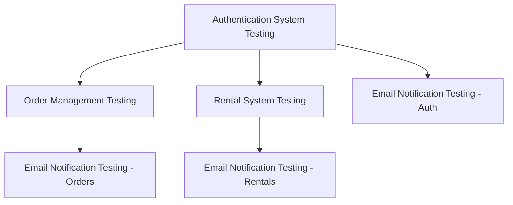

# GigGatek Master Integration Testing Plan

This document provides a comprehensive roadmap for systematically testing all integration points in the GigGatek e-commerce platform, ensuring seamless functionality across the entire system.

## Integration Testing Scope and Purpose

The GigGatek platform consists of several key integrated systems:

1. **Authentication System**: User registration, login, profile management
2. **Order Management System**: Product purchase, checkout, order tracking
3. **Rental Management System**: Rent-to-own contracts, payment scheduling, contract management
4. **Email Notification System**: Transactional and marketing email communications
5. **Payment Processing System**: Stripe integration for one-time and recurring payments

Integration testing verifies that these systems work together correctly, focusing on the interfaces and interactions between components rather than their individual functionalities.

## Testing Sequence and Dependencies

Integration testing must follow a specific sequence based on component dependencies:



### Testing Phase Timeline

| Phase | Timeframe | Focus Areas | Prerequisites |
|-------|-----------|-------------|--------------|
| 1. Authentication | Week 1 | User auth flows, JWT, protected routes | Database setup, API running |
| 2. Order Management | Week 2 | Cart to order, checkout, payment | Authentication working |
| 3. Rental System | Week 3 | Contract creation, payment schedule | Authentication working |
| 4. Email System | Week 4 | All notification types, templates | Auth, orders, rentals working |
| 5. End-to-End | Week 5 | Complete user journeys, edge cases | All systems individually tested |

## Component Testing Guides

Detailed testing procedures for each component are documented in dedicated guides:

1. [Authentication Integration Testing Guide](AUTHENTICATION_INTEGRATION_TESTING.md)
2. [Order Management Integration Testing Guide](ORDER_INTEGRATION_TESTING.md)
3. [Rental System Integration Testing Guide](RENTAL_INTEGRATION_TESTING.md)
4. [Email Notification Integration Testing Guide](EMAIL_NOTIFICATION_INTEGRATION_TESTING.md)

## Test Environment Setup

### Local Development Environment

For integration testing, a complete local environment is required:

```bash
# Clone repository
git clone https://github.com/giggatek/ecommerce-platform.git
cd giggatek

# Install dependencies
cd backend && pip install -r requirements.txt
cd ../frontend && npm install

# Set up database
mysql -u root -p < backend/database/setup.sql

# Configure environment variables
cp .env.example .env
# Edit .env with your configuration

# Start services
docker-compose up -d  # For supporting services like mailhog
```

### Environment Configuration

Create a dedicated testing configuration that includes:

1. **Test Database**: Separate from development database
2. **Mail Capture Server**: Such as MailHog for email testing
3. **Stripe Test Mode**: Using Stripe test API keys
4. **Test User Accounts**: Pre-created with various roles and states

## Testing Tools and Resources

### Required Testing Tools

1. **API Testing**: Postman or Insomnia for API endpoint testing
2. **Frontend Testing**: Browser dev tools, JavaScript console
3. **Database Client**: For verifying data persistence
4. **Email Testing**: MailHog or similar for email capture
5. **JWT Debugger**: For inspecting token contents
6. **Network Analyzer**: For monitoring API requests and responses

### Testing Utilities

1. **Test Data Generators**: Scripts to generate test orders, users, rentals
2. **Database Seeders**: Scripts to populate the database with test data
3. **Automated Testing Scripts**: For repeatable test execution
4. **Mock Payment Handler**: For simulating Stripe webhook events

## Common Integration Points and Error Scenarios

### Critical Integration Points

1. **JWT Authentication Flow**: Token generation, validation, refresh
2. **Shopping Cart to Order**: Cart data transfer to checkout and order creation
3. **Order to Payment**: Payment processing integration with order status updates
4. **Rental Contract Creation**: Product to rental conversion with payment scheduling
5. **Email Event Triggers**: Events that should generate email notifications

### Common Error Scenarios to Test

1. **Authentication Failures**: Invalid credentials, expired tokens
2. **Payment Processing Errors**: Declined payments, webhook failures
3. **Data Validation Issues**: Invalid form submissions
4. **Concurrent Operations**: Multiple operations affecting the same resource
5. **Server Timeouts**: Slow responses or service unavailability
6. **Database Connection Issues**: Connection pool exhaustion, query timeouts

## Test Data Management

### Test Data Requirements

1. **User Accounts**: Various roles (customer, admin) and states (new, established)
2. **Products**: Various categories, prices, rental eligibility
3. **Orders**: Different statuses, payment methods, item quantities
4. **Rentals**: Various terms, payment statuses, progress stages

### Database Seeding

Create a comprehensive seeding script that populates:

```bash
# Run database seeder
python backend/utils/seed_test_data.py
```

## Test Reporting and Documentation

### Test Report Structure

For each integration test, document:

1. **Test ID and Name**: Unique identifier and descriptive name
2. **Components Tested**: Systems involved in the integration
3. **Test Steps**: Detailed procedure for test execution
4. **Expected Results**: What should happen when integration works correctly
5. **Actual Results**: What actually happened during testing
6. **Pass/Fail Status**: Whether the test succeeded or failed
7. **Issues Found**: Details of any integration issues discovered
8. **Screenshots/Logs**: Evidence of test execution

### Issue Tracking

For each integration issue discovered:

1. Create detailed GitHub issue with reproduction steps
2. Assign severity and priority based on impact
3. Link to relevant test report
4. Tag appropriate team members

## Continuous Integration Strategy

### CI/CD Pipeline Integration

1. **Automated Tests**: Implement critical integration tests in CI pipeline
2. **Pre-merge Testing**: Run integration tests before merging PRs
3. **Nightly Builds**: Run full integration suite on nightly builds
4. **Deployment Gate**: Block deployment if integration tests fail

### CI Configuration Example

```yaml
# .github/workflows/integration-tests.yml
name: Integration Tests

on:
  pull_request:
    branches: [ main ]
  schedule:
    - cron: '0 0 * * *'  # Nightly builds

jobs:
  integration-tests:
    runs-on: ubuntu-latest
    
    services:
      mysql:
        image: mysql:8.0
        env:
          MYSQL_ROOT_PASSWORD: root
          MYSQL_DATABASE: giggatek_test
        ports:
          - 3306:3306
          
    steps:
      - uses: actions/checkout@v2
      
      - name: Set up environment
        run: |
          cp .env.example .env.test
          sed -i 's/DB_DATABASE=.*/DB_DATABASE=giggatek_test/' .env.test
          
      - name: Run authentication integration tests
        run: python tests/integration/test_auth.py
        
      - name: Run order integration tests
        run: python tests/integration/test_orders.py
        
      - name: Run rental integration tests
        run: python tests/integration/test_rentals.py
        
      - name: Run email integration tests
        run: python tests/integration/test_emails.py
```

## Cross-Browser and Device Testing

### Browser Compatibility Matrix

| Browser | Versions | Desktop | Mobile |
|---------|----------|---------|--------|
| Chrome | Latest 2 | ✓ | ✓ |
| Firefox | Latest 2 | ✓ | ✓ |
| Safari | Latest 2 | ✓ | ✓ |
| Edge | Latest | ✓ | - |
| iOS Safari | Latest 2 | - | ✓ |
| Android Chrome | Latest 2 | - | ✓ |

### Responsive Design Testing

Test integration points at various screen sizes:
- Desktop (1920×1080, 1366×768)
- Tablet (1024×768, 768×1024)
- Mobile (375×667, 414×896)

## Security Integration Testing

Include security-focused tests that verify:

1. **Authentication**: Token security, session management
2. **Authorization**: Permission enforcement across components
3. **Data Protection**: Sensitive data handling in transit and at rest
4. **API Security**: Rate limiting, input validation
5. **Payment Security**: PCI compliance aspects

## Performance Considerations

While primarily focusing on functional integration, note performance aspects:

1. **Response Times**: Record API response times during integration tests
2. **Transaction Throughput**: Number of orders/rentals that can be processed
3. **Concurrent Users**: System behavior under load

## Integration Testing Checklist

Use this checklist before marking integration testing as complete:

- [ ] All authentication flows successfully tested
- [ ] Order creation and management verified
- [ ] Rental contract creation and management verified
- [ ] Email notifications for all events confirmed
- [ ] Payment processing for all scenarios tested
- [ ] Error handling and recovery tested
- [ ] Cross-browser compatibility verified
- [ ] Mobile responsiveness confirmed
- [ ] All critical user journeys tested end-to-end
- [ ] Security integration verified
- [ ] Performance aspects noted
- [ ] All discovered issues documented
- [ ] Test reports generated and reviewed

## Next Steps After Integration Testing

1. **User Acceptance Testing**: Involve business stakeholders
2. **Performance Testing**: Dedicated load and stress testing
3. **Security Audit**: Comprehensive security assessment
4. **Pilot Deployment**: Limited release to early users
5. **Monitoring Setup**: Prepare production monitoring

By following this master integration testing plan, the team will systematically verify all interactions between GigGatek system components, ensuring a robust and reliable platform ready for production deployment.
