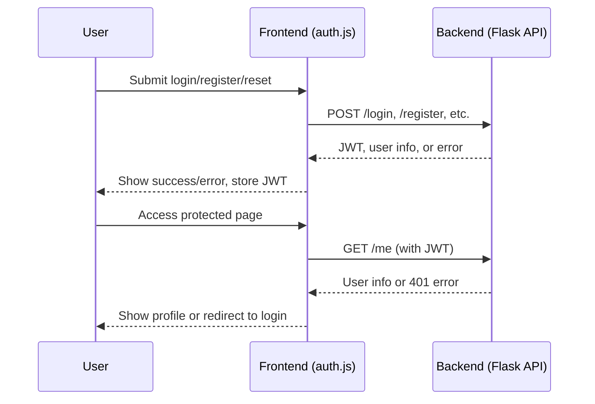

# Authentication Integration Testing Plan for GigGatek

---

## Objective

Ensure seamless integration between frontend (`auth.js`) and backend (Flask JWT API) for all authentication flows, including robust error handling and password reset.

---

## Key Integration Points

- **Frontend:** `frontend/js/auth.js` (Auth class: login, register, refreshToken, getUserProfile, updateProfile, changePassword, requestPasswordReset, resetPassword)
- **Backend:** `backend/auth/routes.py` (endpoints: /register, /login, /refresh-token, /me, /password-reset-request, /password-reset, /update-profile, /change-password)

---

## Test Cases

1. **User Registration**
   - Register with valid data (expect success, JWT returned)
   - Register with existing email (expect error)
   - Register with invalid data (weak password, invalid email)

2. **User Login**
   - Login with valid credentials (expect JWT, user info)
   - Login with invalid credentials (expect error)
   - Login with unregistered email

3. **Token Refresh**
   - Refresh with valid token (expect new JWT)
   - Refresh with expired/invalid token (expect error)

4. **Protected Route Access**
   - Access `/me` with valid JWT (expect user info)
   - Access `/me` with invalid/expired JWT (expect 401)

5. **Password Reset**
   - Request password reset (valid/invalid email)
   - Reset password with valid/invalid token

6. **Profile Update & Change Password**
   - Update profile with valid/invalid data
   - Change password with correct/incorrect current password

7. **Error Handling**
   - Simulate network/server errors
   - Validate error messages and status codes

---

## Recommended Tools

- **API Testing:** Postman or Insomnia (for manual endpoint validation)
- **E2E Testing:** Cypress (preferred for simulating real user flows in browser)
- **Unit/Integration:** Jest (for frontend logic), pytest (for backend)
- **Automated Scripts:** Custom Node.js or Python scripts for batch testing

---

## Step-by-Step Process

1. **Manual API Validation**
   - Use Postman to test all backend endpoints with various payloads.
   - Document expected vs. actual responses.

2. **Frontend-Backend Integration**
   - Run the frontend app, use the Auth class to perform all flows.
   - Check localStorage/sessionStorage for JWT handling.
   - Validate UI feedback for errors and successes.

3. **Automated E2E Testing**
   - Write Cypress tests for registration, login, token refresh, protected route, password reset, and error scenarios.
   - Run tests in CI pipeline if possible.

4. **Error Handling Review**
   - Intentionally break flows (bad tokens, network errors) and verify user-facing error messages.

5. **Password Reset Flow**
   - Request reset, capture email (mock or real), use token to reset password, verify login with new password.

6. **Documentation**
   - Update integration guide with test results, known issues, and troubleshooting tips.

---

## Mermaid Diagram

---

## MCP/Automation Opportunities

- Use Cypress or Playwright MCPs for browser-based E2E automation.
- Use Postman/Newman MCPs for API regression testing.
- Integrate test results into project memory (Qdrant) for traceability.

---

**Next Steps:**  
- Confirm this plan meets your expectations.
- Switch to code mode to begin implementation and test automation.