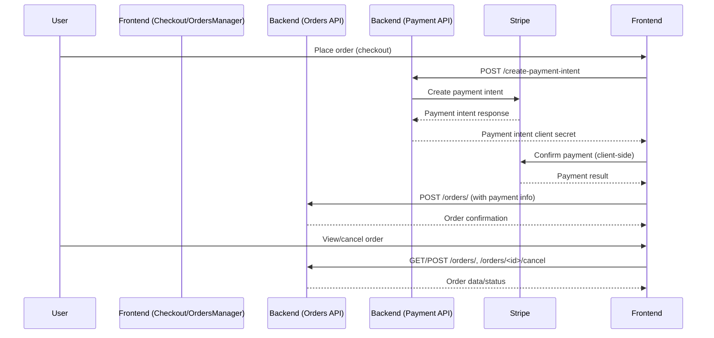

# Order Management Integration & Testing Plan for GigGatek

---

## Objective

Ensure robust integration between frontend and backend for order management, including order creation, status updates, history display, cancellation, and payment processing.

---

## Key Integration Points

- **Backend:**  
  - `backend/orders/routes.py`:  
    - GET `/orders/` (get_user_orders)  
    - GET `/orders/<order_id>` (get_order_details)  
    - POST `/orders/` (create_order)  
    - POST `/orders/<order_id>/cancel` (cancel_order)  
    - PUT `/orders/<order_id>/status` (update_order_status)  
  - `backend/payment/routes.py`:  
    - POST `/create-payment-intent`, `/confirm-payment-intent`, `/webhook` (Stripe integration)

- **Frontend:**  
  - `frontend/js/orders.js` (OrdersManager: loadOrders, viewOrderDetails, cancelOrder, etc.)  
  - `frontend/js/checkout.js` (Checkout: placeOrder, processStripePayment, updateOrderSummary, etc.)  
  - Dashboard and order history UI components

---

## Test Cases

1. **Order Creation**
   - Place order with valid cart and payment (expect order created, payment processed, confirmation shown)
   - Place order with invalid/missing data (expect error)
   - Simulate payment failure (expect error, no order created)

2. **Order Status Updates**
   - Update order status as admin (expect status change reflected in dashboard)
   - Attempt unauthorized status update (expect error)

3. **Order History Display**
   - Load order history for user (expect correct orders, pagination, filtering)
   - View order details (expect all order info, payment status, items, etc.)

4. **Order Cancellation**
   - Cancel eligible order (expect status updated, refund if paid, UI updated)
   - Attempt to cancel non-cancellable order (expect error)

5. **Payment Integration**
   - Process payment via Stripe (expect payment intent created, confirmed, webhook handled)
   - Simulate payment failure (expect error, order not finalized)
   - Verify payment status reflected in order details

6. **Error Handling**
   - Simulate backend errors (DB down, payment API error)
   - Validate user-facing error messages and status codes

---

## Recommended Tools

- **API Testing:** Postman/Insomnia for endpoint validation
- **E2E Testing:** Cypress for simulating user order flows (checkout, history, cancellation)
- **Unit/Integration:** Jest for frontend logic, pytest for backend
- **Stripe Test Dashboard:** For simulating payment scenarios

---

## Step-by-Step Process

1. **Manual API Validation**
   - Use Postman to test all order and payment endpoints with valid/invalid payloads.
   - Document expected vs. actual responses.

2. **Frontend-Backend Integration**
   - Run the frontend, use OrdersManager and Checkout to place orders, view/cancel orders, and process payments.
   - Validate order data in dashboard and order history.

3. **Automated E2E Testing**
   - Write Cypress tests for:
     - Placing an order (with payment)
     - Viewing order history/details
     - Cancelling an order
     - Handling payment failures
   - Run tests in CI pipeline if possible.

4. **Payment Integration Testing**
   - Use Stripe test cards to simulate success/failure.
   - Verify webhook events update order/payment status.

5. **Error Handling Review**
   - Intentionally break flows (invalid data, payment failure) and verify user-facing error messages.

6. **Documentation**
   - Update integration guide with test results, known issues, and troubleshooting tips.

---

## Mermaid Diagram

---

## Automation Opportunities

- Use Cypress for full order flow automation (checkout, payment, history, cancellation).
- Use Stripe's test environment for payment scenarios.
- Integrate test results into project memory (Qdrant) for traceability.

---

**Next Steps:**  
- Confirm this plan meets your expectations.
- Proceed to implement and automate order management integration tests.