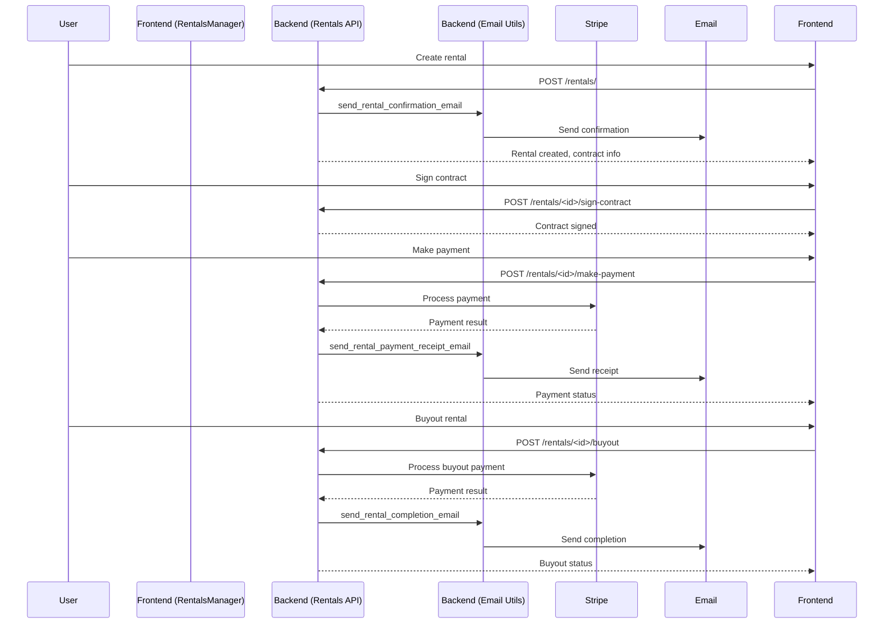

# Rental System Integration & Email Notification Completion Plan

---

## 3. Rental System Integration

### Objective
Ensure robust integration and testing of rental contract creation, signing, payment scheduling, rental history, buyout workflows, and payment tracking visualization.

### Key Integration Points
- **Backend:**  
  - `backend/rentals/routes.py`:  
    - GET `/rentals/`, `/rentals/<id>`, POST `/rentals/`, `/rentals/<id>/cancel`, `/rentals/<id>/make-payment`, `/rentals/<id>/buyout`, `/rentals/<id>/sign-contract`
- **Frontend:**  
  - `frontend/js/rentals.js` (RentalsManager: loadRentals, viewRentalDetails, makePayment, processPayment, initiateEarlyPayment, processEarlyPayoff, etc.)
  - Dashboard rental history and payment visualization components

### Test Cases
1. **Rental Contract Creation**
   - Create rental with valid data (expect contract generated, payment schedule set)
   - Create rental with invalid data (expect error)
2. **Contract Signing**
   - Sign contract (expect status updated, contract stored)
   - Attempt to sign already signed contract (expect error)
3. **Payment Scheduling & Processing**
   - View payment schedule (expect correct due dates, amounts)
   - Make scheduled payment (expect payment processed, status updated)
   - Simulate payment failure (expect error, status unchanged)
4. **Rental History & Buyout**
   - View rental history (expect all rentals, correct statuses)
   - Initiate and process buyout (expect contract closed, payment processed)
   - Attempt buyout on ineligible rental (expect error)
5. **Payment Tracking Visualization**
   - Validate UI shows payment status, due dates, and history accurately

---

## 4. Email Notification Completion

### Objective
Implement all missing email templates and test notification triggers and delivery for password reset, account verification, shipping, and rental completion.

### Key Integration Points
- **Templates:**  
  - `backend/templates/emails/`:  
    - Implement: password_reset.html, account_verification.html, shipping_confirmation.html, rental_completion.html
- **Notification Logic:**  
  - `backend/utils/email.py`:  
    - send_password_reset_email, send_account_verification_email, send_shipping_confirmation_email, send_rental_completion_email, etc.

### Test Cases
1. **Template Implementation**
   - Create and style all missing templates
   - Ensure templates render correctly with context data
2. **Notification Triggers**
   - Trigger each notification via backend logic (e.g., password reset request, account registration, order shipped, rental completed)
   - Validate email is sent, content is correct, and links/tokens work
3. **Delivery Testing**
   - Test with real and mock email addresses
   - Validate error handling for failed delivery

---

## Implementation Guide

### API Testing: Postman/Insomnia

- **Setup:**
  - Import or create a collection for all rental and email notification endpoints.
  - Use environment variables for base URL, auth tokens, and test data.
- **Test Flows:**
  - Rental creation, contract signing, payment, buyout, and all notification triggers.
  - Validate responses, status codes, and returned data.
- **Automation:**
  - Use Postman/Newman CLI for automated regression testing.

### E2E Testing: Cypress

- **Setup:**
  - Install Cypress and configure baseUrl for the frontend.
  - Write tests for:
    - Rental creation and contract signing
    - Payment scheduling and processing (simulate Stripe payment)
    - Rental history, buyout, and payment tracking visualization
    - Email notification triggers (mock or real SMTP)
- **Best Practices:**
  - Use fixtures for test data.
  - Use Cypress commands for login and setup.

### Stripe Test Dashboard

- **Usage:**
  - Use Stripe's test mode and test cards for all payment scenarios.
  - Simulate payment success, failure, and edge cases.
  - Monitor webhook events and payment status in the Stripe dashboard.

### SMTP Delivery Testing

- **Test SMTP Server:**
  - Use: `admin@giggadev.com`  
  - Password: `teamrsi12!@`
  - Configure backend email settings to use this SMTP server for all test emails.
  - Monitor inbox for delivery, formatting, and content validation.

---

## Mermaid Diagram

---

## Automation Opportunities

- Use Cypress for full rental flow automation (creation, signing, payments, buyout, history).
- Use Postman/Newman for API regression testing.
- Use Stripe's test environment for payment scenarios.
- Use the provided SMTP server for safe email delivery testing.
- Integrate test results into project memory (Qdrant) for traceability.

---

**Next Steps:**  
- Proceed to implement and automate rental system and email notification integration tests as outlined.